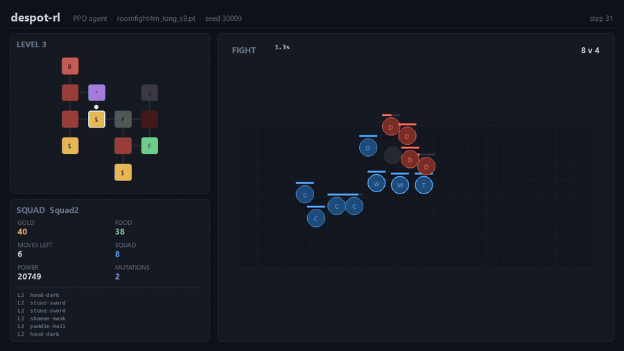

# despot-rl

Reinforcement learning against a faithful headless simulator of *Despot's Game:
Dystopian Battle Simulator*, built from the shipped game's own balance tables.

*A trained agent buying food, walking a generated level, and taking a fight.
The full 70-second run is [`docs/run.mp4`](docs/run.mp4), rendered by
[`tools/render_run.py`](tools/render_run.py). That run reaches level 5 against
the arm's mean of 2.9, so it is a good run rather than a typical one.*

## What this is

Three pieces that only mean something together.

**A simulator that is trying to be the game, not a game like it.** The unit,
item, mutation and level tables are the ones the game ships, read out of its
encrypted asset bundles; combat is continuous-space steering (grid A*, ORCA
local avoidance, and the game's own NodeCanvas behaviour trees) at a fixed
50 Hz tick, not a grid-step resolution. Every number that is still a guess
lives in one file, `sim/assumptions.py`, rather than being spread through the
code as a magic constant.

**A hierarchical agent.** The high level plays the run (where to move, what to
buy, when to upgrade the shop, which mutation to take) as a 195-dimensional
observation with 33 masked actions; the low level places the squad on the grid
before each fight. Both are PPO. Fights resolve inside the environment, so a
run-level decision is graded by a fight that actually happened.

**A measurement habit.** A simulator an agent trains against is a thing the
agent will exploit, and most of what this project has learned came from an
agent finding something cheaper in the sim than in the game. The `notes/`
directory is the running record of that, including the results that were later
retracted.

## Results

A run is twelve levels. Nothing here finishes one.

| | mean level reached |
|---|---|
| Random policy | 1.429 |
| Hand-written heuristic | **3.946** |

Graded over 240 fixed evaluation seeds, with the eight starting squads cycled.
No trained agent has been measured on this environment yet: it was corrected on
2026-09-02 and every agent before that no longer loads.

**Why there are no PPO numbers here right now.** A player pointed out that the
sim did not match the game, and they were right twice over. Every room in the
game has a fight, and its shop, shrine, doors and gold only open once that fight
is won; and a run does not start from `Game.Team.Packs` but from one of eight
squads in `ChipChoice/Squads.json`. The sim was fighting in about a third of its
rooms and opening with five bare Novices at 750 Power against squads the game
never hands anyone, which are 3,783 to 7,176. Both are fixed, and the numbers
that follow from them have to be re-measured rather than carried over.

For the record, on the superseded environment: heuristic 2.283, PPO 2.561 at
600k and 2.932 at 2M over twelve seeds, with a standard deviation of 0.098
across identically configured 2M agents. The methodology below survives the
change; those particular levels do not.

**The largest effect ever measured here is which squad you start with**: a whole
level of spread between the eight, 3.467 to 4.492 under the heuristic, against
the tenth of a level that separates identically configured 2M agents. It is now
part of the observation, cycled across episodes, so the agent plays all eight
rather than being handed one.

The largest effect before that was **training budget**, which was embarrassing
enough to state plainly, because four separate environment features were
designed, built and measured before it was clear. Off one run per seed with
checkpoints, so no init or architecture difference is in it (measured on the
superseded environment):

| budget | mean level | mutations held | free mutation taken |
|---|---|---|---|
| 600k | 2.561 | 0.34 | 0.2% |
| 1.2M | 2.810 | 1.30 | 22.9% |
| 1.8M | 2.886 | 1.97 | 28.4% |
| 2M | 2.932 | 2.14 | 29.2% |

2M minus 600k, paired within seed: **+0.370 levels, 95% CI [+0.310, +0.431],
positive on 12 of 12**. The behaviour under study at 600k, taking a free
mutation, occurred 0.2% of the time, so every A/B run at that budget was
comparing two copies of a policy that did not use the thing being tested.

## What the measurements turned up

The findings that generalise past this game:

- **An A/B on an environment feature is meaningless until both arms have
  trained long enough to use the feature.** Check the behavioural share, the
  uptake or the holdings, before reading any score difference.
- **Changing the observation changes the architecture.** The first layer is
  sized from `obs_dim`, so adding a feature also changes the parameter count,
  the init draw and the optimisation path. Five features in a row here survived
  their own ablation: hold the entry at zero and keep it in the vector, and the
  score does not move. The most recent, describing the mutation shelf, measures
  **+0.01 levels [-0.06, +0.08]** against a blinded control at 2M.
- **A real control is a wider control.** One sweep's control arm was silently
  never inert, because the disable path rewrote a registry entry that a fallback
  lookup read around it. Fixing it widened the standard deviation across
  identically configured agents from 0.132 to 0.183.
- **Four times an agent found an action cheaper in the sim than in the game**,
  and each time it looked like a strategy rather than a bug: a squad that
  started fully armed, a room that paid gold on every visit, free food, and a
  stranded run that scored better than a wipe.
- **The fifth and largest was found by a player, not by an agent.** Reading the
  binary is not the same as playing the game: two of its load-bearing facts, that
  every room fights and that a run starts from a chosen squad, sat in files this
  project had read past for weeks. The report that "this doesn't match the game"
  was worth more than any amount of further inference from the same data.

## The simulator

`sim/` is the readable, slow oracle. It is written to be diffed against the
decompiled game rather than to run quickly.

    sim/data.py         ruleset loading and the game's own override layering
    sim/spec.py         unit + item -> resolved stats
    sim/nav.py          room grid, A*, waypoint following
    sim/orca.py         RVO2 / ORCA local avoidance
    sim/bt.py           NodeCanvas behaviour tree executor
    sim/actions.py      the default attack and the class skills
    sim/unit_skills.py  per-unit skills from Skills.json
    sim/mutations.py    run-level mutations
    sim/mapgen.py       a port of the game's LevelGenerator
    sim/battle.py       the fixed-timestep loop
    sim/run.py          levels, rooms, economy, shops, progression
    sim/assumptions.py  every number that is still a guess

Levels are generated per run by a port of the game's `LevelGenerator`, including
the position weighting, the 2x2 block rations and the neighbour cap, so a level
is the corridor web the game builds rather than a blob. Three parameters could
not be recovered from the binary and are recorded as assumptions.

## The Rust core

`core/` is a port of the battle loop as a `cdylib` with a plain C ABI, called
through `ctypes`. It exists only to run the same fight faster; the Python
implementation stays the oracle, and `sim/fast.py` **refuses** any fight outside
the ported envelope rather than returning numbers that quietly drift.

| six broadswords against six enemies | ms per battle | speedup |
|---|---|---|
| Python oracle | 276 | 1x |
| Rust, one call at a time | 1.9 | 142x |
| Rust, batched across threads | 0.29 | 957x |

`tools/diff_core.py` runs the same fights through both engines. It caught a real
porting bug immediately: melee reach is measured against both bodies, so a
radius-3 attacker needs 10 units to touch a radius-6 target, not the 7 it needs
against its own size. Winner agreement inside the envelope went from 24/60 to
60/60.

## Layout

    sim/      the reference simulator
    core/     the Rust battle core
    rl/       Gymnasium env, placement policies, the heuristic baseline, PPO
    tools/    datamining, validation, evaluation, rendering
    notes/    the running record: datamining, reference sim, Rust core, RL

The four files in `notes/` carry the numbers and the mechanics, including what
has been retracted. Read those before re-deriving anything.

## Running it

Python 3.12 or newer.

    pip install -e .                 # the simulator and the RL side
    pip install -e ".[render]"       # plus the video renderer (ffmpeg on PATH)
    pip install -e ".[datamining]"   # plus the extraction pipeline

    python tools/validate_sim.py        # the sim's check suite
    python tools/validate_rl.py         # the RL side's check suite
    python tools/run_demo.py            # a narrated run under a random policy
    python rl/train.py --steps 2000000 --checkpoint-every 600000 --seed 0
    python tools/compare_agents.py --agent runs/<checkpoint>.pt
    python tools/render_run.py --agent runs/<checkpoint>.pt --seed 30039

Everything past the installs reads the extracted balance tables, so it needs the
data step in the next section first.

Build the Rust core with `cargo build --release` in `core/`. Without it
everything still runs, roughly 140x slower per fight. Training defaults to CPU;
the net is a two-layer MLP and a GPU buys it nothing.

## Data

**No game data is redistributed here**, and none is required to read the code.
To run anything you need your own copy of the game: `tools/` extracts and
decrypts its asset bundles into `data/`, which is gitignored.

The bundles are Rijndael-256 (not AES: the 256-bit block is why no mainstream
crypto library will open them), gzipped, with the key derived by PBKDF2 from a
passphrase held in the binary. That passphrase is **not** in this repository.
The tools read it from `DESPOT_PASSPHRASE`, and `notes/datamining.md` describes
where it lives and how it was found, including the sweeps that do not find it.
